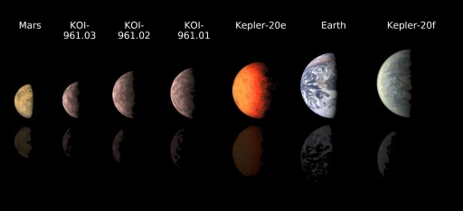

# Machine Learning Challenge - Exoplanet Exploration

## Note

Optional Homework to gain a much greater understanding of testing and tuning different Classification models.

## Background

Over a period of nine years in deep space, the NASA Kepler space telescope has been out on a planet-hunting mission to discover hidden planets outside of our solar system.

To help process this data, machine learning models capable of classifying candidate exoplanets have been created from the raw dataset. The following process was followed:

1. [Preprocess the raw data](#Preprocessing)
2. [Tune the models](#Tune-Model-Parameters)
3. [Compare two or more models](#Evaluate-Model-Performance)

### Preprocess the Data

* Preprocessed the dataset prior to fitting the model.
* Performed feature selection and removed unnecessary features.
* Used `MinMaxScaler` to scale the numerical data.
* Separated the data into training and testing data.

### Tune Model Parameters

* Used `GridSearch` to tune model parameters.
* Tuned and compared at least two different classifiers.

### Reporting

* Created a README that reports a comparison of each model's performance as well as a summary about findings and assumptions.
